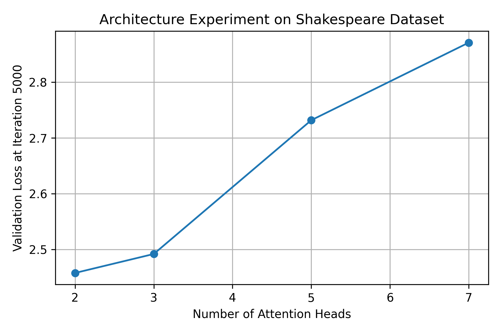

# SEEM3650 Practical Exam 2 Report

Name: Aaron Tang Kwan Po  
Student ID: 1155192866  

## Step 2: Shakespeare Character-level Model

Dataset preparation command:

```bash
python data/shakespeare_char/prepare.py
```

Dataset preparation output:

```text
length of dataset in characters: 1,115,394
all the unique characters: !$&',-.3:;?ABCDEFGHIJKLMNOPQRSTUVWXYZabcdefghijklmnopqrstuvwxyz
vocab size: 65
train has 1,003,854 tokens
val has 111,540 tokens
```

First 5 lines of generated Shakespeare sample:

```text
ANGELO:
And cowards it be straighted by your hands.
3 KING EDWARD IV:
What, uncle, therefore?

HASTINGS:
Provost, thou hast not straight it, I commit thy
```

## Step 3: Model Architecture Exploration

Since `XYZ = 866` and `866 mod 4 = 2`, I fixed the number of layers at 7 and tested different numbers of attention heads.

| Layers | Heads | Validation Loss at Iteration 5000 |
|---:|---:|---:|
| 7 | 2 | 2.4576 |
| 7 | 3 | 2.4917 |
| 7 | 5 | 2.7319 |
| 7 | 7 | 2.8712 |

The plot was saved at:

```text
figures/shakespeare_heads_loss.png
```



The 2-head model gave the lowest validation loss at iteration 5000. All four runs started to overfit after around 1500 iterations, but based on the required comparison at iteration 5000, the best setting was:

```text
n_layer = 7
n_head = 2
n_embd = 210
```

I used `n_embd = 210` because it can be divided by all tested head numbers: 2, 3, 5, and 7.

## Step 4: Training BabyGPT for Code Generation

Since `XYZ = 866` and `866 mod 2 = 0`, I used open-source C/C++ code as the training dataset.

The dataset was saved as:

```text
data/code_generation/input.txt
```

Dataset preparation command:

```bash
python data/code_generation/prepare.py
```

Dataset preparation output:

```text
length of dataset in characters: 967,313
vocab size: 97
train has 870,581 tokens
val has 96,732 tokens
```

The dataset has more than 100,000 tokens, so it satisfies the requirement.

The training config was saved as:

```text
config/train_code_generation.py
```

Generated code sample, first 20 lines:

```cpp
return base_iterator(*this) - base_iterator(other);

case value_t::
    return (m_it.object_iterator == other.m_it.object_iterator);

case value_t::array:
    return (m_it.array_iterator == other.m_it.array_iterator);

case value_t::null:
case value_t::string:
case value_t::boolean:
case value_t::number_integer:
case value_t::number_unsigned:
case value_t::number_fl

result = static_cast<std::size_t>(number);
return true;
```

My favorite generated snippet:

```cpp
case 'L':
{
    std::int64_t number{};
    if (JSON_HEDLEY_UNLIKELY(!get_number(input_format, number)))
    {
        return false;
    }
    result = static_cast<std::size_t>(number);
    return true;
}
```

I chose this snippet because it looks more like normal C++ code. It has a switch-case pattern, brackets, typed variable declaration, error checking, and `static_cast`. 